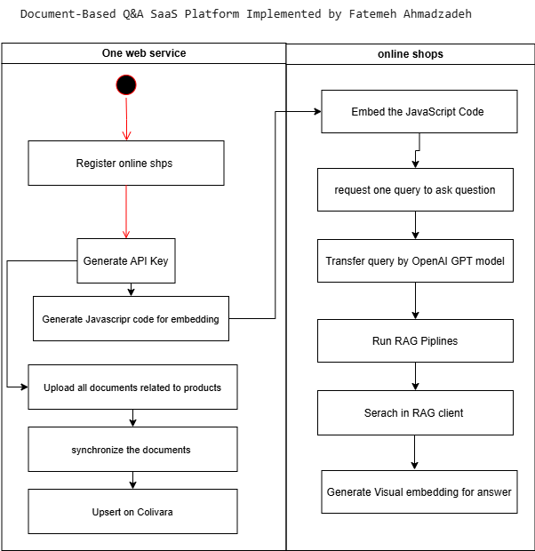

# Document-Based Q&A SaaS Platform


## Overview

A SaaS platform that enables online shops to upload product catalogs and documents, then provides AI-powered Q&A capabilities to their customers based on the uploaded content. Built with Django REST Framework, PostgreSQL, Colivara, OpenAI, Celery, and Redis.

## Key Features

- **Multi-tenant API Key System**: Each online shop gets a unique API key
- **Document Processing Pipeline**: Automated processing of uploaded PDFs/manuals
- **Upsert Documents on colivara**: Update Or Add documents to special collection name
- **AI-Powered Q&A**: RAG (Retrieval-Augmented Generation) system using OpenAI's GPT models
- **Scalable Architecture**: Celery workers for background processing, Redis for caching
- **Self-Service Portal**: API key management and analytics for shop owners

## Technology Stack

- **Backend**: Django REST Framework
- **Database**: PostgreSQL
- **Vector Database**: Colivara as visual embeddings
- **AI Models**: OpenAI API
- **Task Queue**: Celery
- **Caching**: Redis
- **Email Testing**: smtp4dev
- **Containerization**: Docker Compose

## Getting Started

### Prerequisites

- Docker and Docker Compose installed
- OpenAI API key
- Colivara API key
- Environment variables configured (see `.env.example`)

### Installation

1. Clone the repository:
   ```bash
   git clone https://github.com/Ahmadzadeh920/FitMatchFinder.git
   cd core/customized_RAG
   ```

2. Create and configure your environment file
    ```bash
    SECRET_KEY = 
    DEBUG = 
    SERVERNAMES = 
    DB_NAME = 
    DB_USER = 
    DB_PASSWORD = 
    DB_HOST = 
    DB_PORT =
    Domain = 
   
    PGADMIN_DEFAULT_EMAIL = 
    PGADMIN_DEFAULT_PASSWORD =

    API_KEY_COLIVARA = 
    API_KEY_OpenAI = 


3. Building & Running
```bash
docker-compose up -d --build
```
4. Apply database migrations:
```bash 
docker-compose exec backend python manage.py migrate
```
### Running the System
- Main API: http://localhost:8000

- Admin Interface: http://localhost:8000/admin

- pgAdmin: http://localhost:5050

- Email Testing: http://localhost:5000

- Documentation: http://localhost:8002

## API Documentation
The API documentation is automatically generated and available at: http://localhost:8002 when the docs service is running.

### Testing
```bash
docker-compose exec backend sh -c "python manage.py test customized_RAG.tests"
```
### Architecture
#### Core Components
1- API Layer: Django REST Framework handles all HTTP requests

2- Document Processing:

- File uploads stored in PostgreSQL

- Background processing via Celery workers

- Upsert documets of online shops 
        
3- Query Processing:

- transform query using OpenAI GPT

- Run RAG pipline by seraching in special collection name(API key) on Colivara

- Generate visual embrdding image

Caching and workers : Redis caches frequent queries and embeddings and celery workers for processing these file in Colivara

### Data Flow



### File Structure
```markdown

.
├── core/                   # Django project root
│   ├── customized_RAG/     # Main app with RAG functionality
│   ├── accounts/           # Customized authetication and API key management
│   ├── settings/           # Django settings
│   └── docs/               # API documentation
├── data/                   # Database volume
├── requirements/           # Python dependencies
└── docker-compose.yml      # Docker configuration
```

## Deployment
For production deployment, consider:

- Setting DEBUG=0 in environment variables

- Configuring proper SSL/TLS termination

- Setting up monitoring for Celery workers

- Implementing proper backup strategy for PostgreSQL and Colivara


## License
MIT License

## Support
For support or feature requests, please open an issue in the GitHub repository.